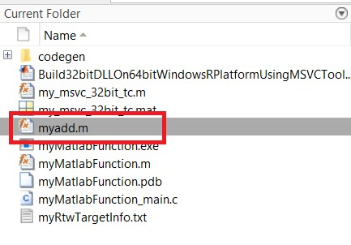
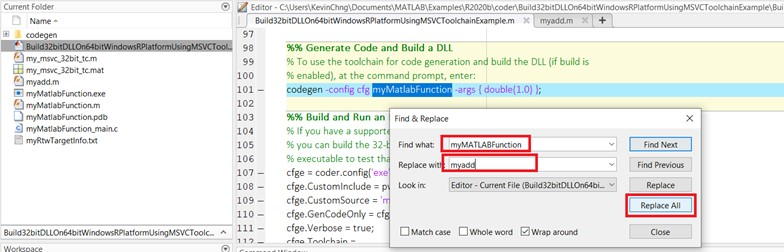
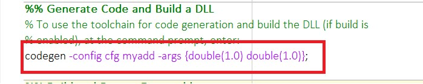
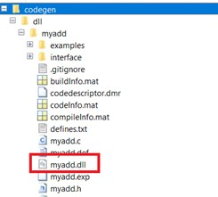
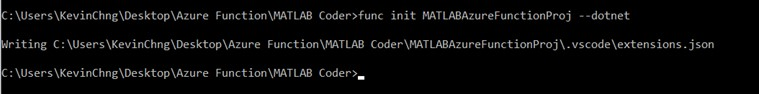
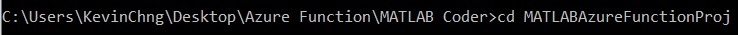
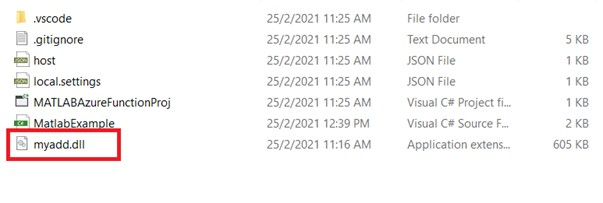
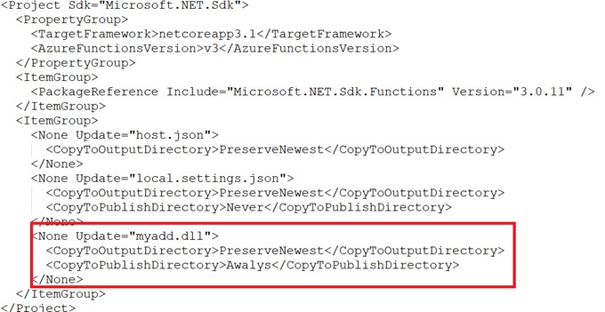
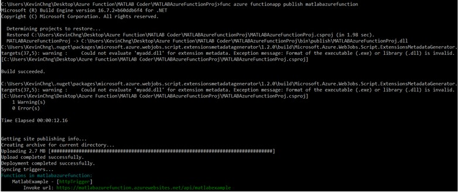

# Deploy MATLAB algorithm to Azure Function – MATLAB Coder

---

## Introduction :

MATLAB is not supported natively with Azure Function – Serverless. For workaround, we have to generate standalone c/c++ source code from MATLAB algorithm and wrap it as dll. 
By default, Azure function supports 32bits Platform, it might require more troubleshooting if we try to switch it to 64bits. Therefore, the generated MATLAB .dll has to be 32bits. This process could be done using MATLAB Coder and Visual Studio Compiler. Subsequently, we embed this .dll into our Azure Function dotnet framework and later deploy to Azure Cloud. However, MATLAB Coder does not support code generation for all MATLAB function, you may refer to the list below for supported function :
https://www.mathworks.com/help/coder/ug/functions-and-objects-supported-for-cc-code-generation.html

### Pre-requisites:
1) [Install Azure Function Tool](https://docs.microsoft.com/en-us/azure/azure-functions/functions-run-local?tabs=windows%2Ccsharp%2Cbash#v2)
2)	Microsoft Visual Studio 9.0/10.0/11.0/12.0/14.0/15.0
3)	MATLAB & MATLAB Coder

### References:
1)	[Generate 32bits dll using MATLAB Coder](https://www.mathworks.com/help/coder/ug/build-32-bit-dll-on-64-bit-windows-platform-using-msvc-toolchain.html)
2)	[Create C# function in Azure for Command Line (Azure Function)](https://docs.microsoft.com/en-us/azure/azure-functions/create-first-function-cli-csharp?tabs=azure-cli%2Cbrowser)

---

## Example :
1)	Build MATLAB function as follows:


 

2)	Open example below to generate your MATLAB function as standalone 32bits dll.
In your MATLAB, type 
```
openExample('coder/Build32bitDLLOn64bitWindowsRPlatformUsingMSVCToolchainExample')
```
In this example, it demonstrates how to generate myMatlabFunction.m (A MATLAB function) to standalone 32bits dll. Now, copy your MATLAB function(myadd.m) to this path.


 
3)	In the example (Build32bitDLLOn64bitWindowsRPlatformUsingMSVCToolchainExample.m), replace all myMatlabfunction with your function name (myadd) as follows:

 

4)	In the line 101/Under “Generate Code and Build a DLL” Section, add one more argument – double(1.0) :
 
 
 
5)	Now, play “run” to run the entire script.
[Notes : you might have error in the last section, kindly ignore it as we don’t need executable file in this demo]
Now, you can look for .dll in the codegen folder.


 
6)	Open command window to create Azure Function in a folder named MATLABAzureFunctionProj with the C#/dotnet runtime.


 
7)	Navigate into the project folder.


 
8)	Add a function to your project, where the –name argument is the unique name of your function (MatlabExample) and the –template argument specifies the function’s trigger (HTTP).



If the screen above is too small, you may copy the command below :
```
func new --name MatlabExample --template "HTTP trigger" --authlevel "anonymous"
```

9)	Copy the generated dll into the path of Azure Function’s Folder.


 
10)	Open MATLABAzureFunctionProj.csproj with Notepad, add myadd.dll into the itemgroups as follow :
 


11)	Open MatlabExample.cs with Notepad, edit the code :
```
using System;
using System.IO;
using System.Threading.Tasks;
using Microsoft.AspNetCore.Mvc;
using Microsoft.Azure.WebJobs;
using Microsoft.Azure.WebJobs.Extensions.Http;
using Microsoft.AspNetCore.Http;
using Microsoft.Extensions.Logging;
using Newtonsoft.Json;
using System.Runtime.InteropServices;

namespace MATLABAzureFunctionProj
{
    public static class MatlabExample
    {
		[DllImport("myadd.dll", CallingConvention = CallingConvention.Cdecl)]
        static extern double myadd(double a, double b);
		
        [FunctionName("MatlabExample")]
        public static async Task<IActionResult> Run(
            [HttpTrigger(AuthorizationLevel.Anonymous, "get", "post", Route = null)] HttpRequest req,
            ILogger log)
        {
            log.LogInformation("C# HTTP trigger function processed a request.");

            string value1 = req.Query["value1"];
			string value2 = req.Query["value2"];
			double doubleVal1 = Convert.ToDouble(value1);
			double doubleVal2 = Convert.ToDouble(value2);
			double x = myadd(doubleVal1,doubleVal2);

            string requestBody = await new StreamReader(req.Body).ReadToEndAsync();
            dynamic data = JsonConvert.DeserializeObject(requestBody);
            value1 = value1 ?? data?.value1;

            string responseMessage = string.IsNullOrEmpty(value1)
                ? "This HTTP triggered function executed successfully. Pass a 2 values-value1 & value2 in the query string or in the request body for a personalized response."
                : $"The sum is {x}";

            return new OkObjectResult(responseMessage);
        }
    }
}
```


## Create Supporting Azure Resources for your function
[Notes: Please skip this steps 12 -15 if you want to update this application to your existing resource group, storage account and Azure Function]

12)	If you haven't done so already, sign in to Azure:
	```
	az login
	```
The az login command signs you into your Azure account.

13)	Create a resource group named AzureFunctionsQuickstart-rg in the westeurope region:
	```
	az group create --name AzureFunctionsQuickstart-rg --location westeurope
	```
The az group create command creates a resource group. You generally create your resource group and resources in a region near you, using an available region returned from the az account list-locations command.

14)	Create a general-purpose storage account in your resource group and region:
	```
	az storage account create --name <STORAGE_NAME> --location westeurope --resource-group AzureFunctionsQuickstart-rg --sku Standard_LRS
	```
The az storage account create command creates the storage account.
In the previous example, replace <STORAGE_NAME> with a name that is appropriate to you and unique in Azure Storage. Names must contain three to 24 characters numbers and lowercase letters only. Standard_LRS specifies a general-purpose account, which is supported by Functions.

15)	Create the function app in Azure:
	```
	az functionapp create --resource-group AzureFunctionsQuickstart-rg --consumption-plan-location westeurope --runtime dotnet --functions-version 3 --name <APP_NAME> --storage-account <STORAGE_NAME>
	```
The az functionapp create command creates the function app in Azure.
In the previous example, replace <STORAGE_NAME> with the name of the account you used in the previous step, and replace <APP_NAME> with a globally unique name appropriate to you. The <APP_NAME> is also the default DNS domain for the function app.

## Deploy the function project to Azure.

16)	 In the following example, replace <APP_NAME> with the name of your app.

```
func azure functionapp publish <APP_NAME>
```

For my case :


 
```
func azure functionapp publish matlabazurefunction
```

17)	Open browser to access my function as follows:
https://matlabazurefunction.azurewebsites.net/api/matlabexample?value1=1&value2=2


