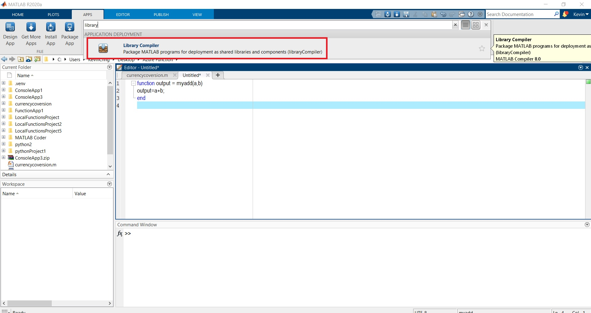

# Deploy MATLAB algorithm to Azure Function – MATLAB Compiler SDK (Use Window for development)
Use window as development environment and pusblish to Azure Function

---

## Introduction :

MATLAB is not supported natively with Azure Function – Serverless. Recently, Azure Function supports docker image, now we can create Azure Functions as a custom Docker container using a Linux base image. Docker conatiners open the door to hosting in a lot more environments than previously possible. This combo give us the flexibility to easily deploy and run our microservices either in the cloud or on-premises.

This customer image allows us to install additional dependency or configuration that isn't provided by the built in image. We insall MATLAB runtime (MCR) inside this custom docker container to provide the environment to run MATLAB code.

Although you are allowed to install additional dependency inside the custom docker, it is still restricted us to only use the following languages: C#,Java,Javascript,PowerShell,Python,TypeScript

For this solution, I use python as a bridge to linkup Azure Function and MCR. However, when you are selecting other languages, kindly make sure that your selected linux base image is 64bit which MCR requires 64bits environment.

Azure Function Image Overview:
https://hub.docker.com/_/microsoft-azure-functions-base

Azure Function image for python :
https://hub.docker.com/_/microsoft-azure-functions-python

Deploying function code in a custom Linux container requires Premium plan or a Dedicated (App Service) plan hosting. Therefore, completing this example might incurs costs of a few US dollars in your Azure account, which you can minimize by cleaning-up resources when you're done.


### Pre-requisites:
1) [Azure Function Tool](https://docs.microsoft.com/en-us/azure/azure-functions/functions-run-local?tabs=windows%2Ccsharp%2Cbash#v2)
2) The Azure CLI version 2.4 or later.
3) Python 3.8 (64-bit), Python 3.7 (64-bit), Python 3.6 (64-bit), which are supported by Azure Functions.
4) Docker and Docker ID
5) MATLAB and MATLAB Compiler SDK

### Prerequisite check
In a terminal or command window, 

1) Run 

```
func --version 
```

to check that the Azure Functions Core Tools are version 2.7.1846 or later.

2) Run 

```
az --version 
```

to check that the Azure CLI version is 2.0.76 or later.

3) Run 

```
az login 
```

to sign in to Azure and verify an active subscription.

4) Run 

```
python --version (Linux/MacOS) or py --version (Windows) 
```

to check your Python version reports 3.8.x, 3.7.x or 3.6.x.

5) Run

```
docker login 
```

to sign in to Docker. This command fails if Docker isn't running, in which case start docker and retry the command.

### References:
1) [Generate Python Package and Build Python Application](https://www.mathworks.com/help/compiler_sdk/gs/create-a-python-application-with-matlab-code.htmll)
2) [Create a function on Linux using a custom container (Azure Function)]https://docs.microsoft.com/en-us/azure/azure-functions/functions-create-function-linux-custom-image?tabs=bash%2Cportal&pivots=programming-language-python)

---

## Example :

### MARLAB

1. Build MATLAB function as follows:


2. Open libary compiler to generate python package:




3. Now you have the generated python package inside the "for_redistribution_files_only" folder :


Files inside the "for_redistribution_files_only" folder:


4. Open cmd, navigate to this foler to install this generated python package.


### Create and test the local functions project

4. In a terminal or command prompt, run the following command for your chosen language to create a function app project in a folder named LocalFunctionsProject.

```
func init LocalFunctionsProject --worker-runtime python --docker
```

The --docker option generates a Dockerfile for the project, which defines a suitable custom container for use with Azure Functions and the selected runtime.

5. Navigate into the project folder:

```
cd LocalFunctionsProject
```

6. Add a function to your project by using the following command, where the --name argument is the unique name of your function and the --template argument specifies the function's trigger. 

```
func new --name HttpExample --template "HTTP trigger"
```

7. Edit HTTP triger to import our generated Python package.


