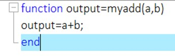
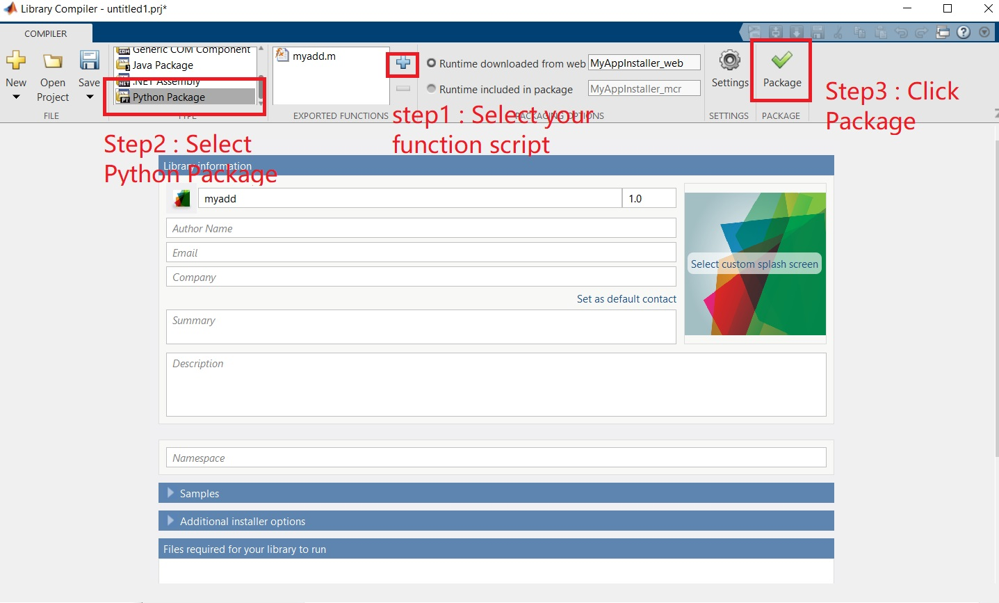
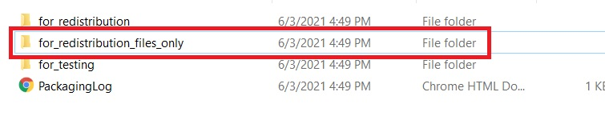
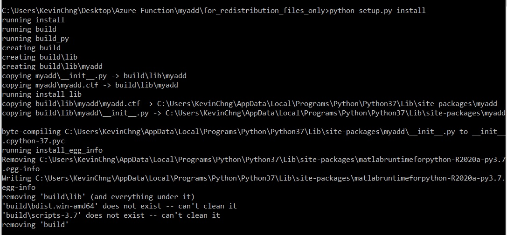

# Deploy MATLAB algorithm to Azure Function – MATLAB Compiler SDK (Use Window for development)
Use window as development environment and pusblish to Azure Function

---

## Introduction :

MATLAB is not supported natively with Azure Function – Serverless. Recently, Azure Function supports docker image, now we can create Azure Functions as a custom Docker container using a Linux base image. Docker conatiners open the door to hosting in a lot more environments than previously possible. This combo give us the flexibility to easily deploy and run our microservices either in the cloud or on-premises.

This customer image allows us to install additional dependency or configuration that isn't provided by the built in image. We insall MATLAB runtime (MCR) inside this custom docker container to provide the environment to run MATLAB code.

Although you are allowed to install additional dependency inside the custom docker, it is still restricted us to only use the following languages: C#,Java,Javascript,PowerShell,Python,TypeScript

For this solution, I use python as a bridge to linkup Azure Function and MCR. However, when you are selecting other languages, kindly make sure that your selected linux base image is 64bit which MCR requires 64bits environment.

Azure Function Image Overview:
https://hub.docker.com/_/microsoft-azure-functions-base

Azure Function image for python :
https://hub.docker.com/_/microsoft-azure-functions-python

Deploying function code in a custom Linux container requires Premium plan or a Dedicated (App Service) plan hosting. Therefore, completing this example might incurs costs of a few US dollars in your Azure account, which you can minimize by cleaning-up resources when you're done.


### Pre-requisites:
1) [Azure Function Tool](https://docs.microsoft.com/en-us/azure/azure-functions/functions-run-local?tabs=windows%2Ccsharp%2Cbash#v2)
2) The Azure CLI version 2.4 or later.
3) Python 3.8 (64-bit), Python 3.7 (64-bit), Python 3.6 (64-bit), which are supported by Azure Functions.
4) Docker and Docker ID
5) MATLAB and MATLAB Compiler SDK

### Prerequisite check
In a terminal or command window, 

1) Run 

```
func --version 
```

to check that the Azure Functions Core Tools are version 2.7.1846 or later.

2) Run 

```
az --version 
```

to check that the Azure CLI version is 2.0.76 or later.

3) Run 

```
az login 
```

to sign in to Azure and verify an active subscription.

4) Run 

```
python --version (Linux/MacOS) or py --version (Windows) 
```

to check your Python version reports 3.8.x, 3.7.x or 3.6.x.

5) Run

```
docker login 
```

to sign in to Docker. This command fails if Docker isn't running, in which case start docker and retry the command.

### References:
1) [Generate Python Package and Build Python Application](https://www.mathworks.com/help/compiler_sdk/gs/create-a-python-application-with-matlab-code.htmll)
2) [Create a function on Linux using a custom container (Azure Function)]https://docs.microsoft.com/en-us/azure/azure-functions/functions-create-function-linux-custom-image?tabs=bash%2Cportal&pivots=programming-language-python)

---

## Example :

### MARLAB

1. Build MATLAB function as follows:



2. Open libary compiler to generate python package:




3. Now you have the generated python package inside the "for_redistribution_files_only" folder :



Files inside the "for_redistribution_files_only" folder:


4. Open cmd, navigate to this foler to install this generated python package.

```
python setup.py install
```

You would get the outcome as follows:



### Create and test the local functions project
I use powershell for the following steps.

4. In a terminal or command prompt, run the following command for your chosen language to create a function app project in a folder named LocalFunctionsProject.

```
func init LocalFunctionsProject --worker-runtime python --docker
```

The --docker option generates a Dockerfile for the project, which defines a suitable custom container for use with Azure Functions and the selected runtime.

5. Navigate into the project folder:

```
cd LocalFunctionsProject
```

6. Add a function to your project by using the following command, where the --name argument is the unique name of your function and the --template argument specifies the function's trigger. 

```
func new --name HttpExample --template "HTTP trigger"
```

7. Edit HTTP triger to import our generated Python package :

Open HttpExample Folder, then open "init.py", edit it to as follows:

```
import logging
import azure.functions as func
import myadd

def main(req: func.HttpRequest) -> func.HttpResponse:
	logging.info('Python HTTP trigger function processed a request.')
	value1 = req.params.get('value1')
	value2 = req.params.get('value2')
	
	if not value1:
		try:
			req_body = req.get_json()
		except ValueError:
			pass
		else:
			value1= req_body.get('value1')
			value2= req_body.get('value2')
	
	if value1:
		myadd.initialize_runtime(['-nojvm', '-nodisplay'])
		m=myadd.initialize()
		final = m.myadd(float(value1),float(value2))
		return func.HttpResponse(f"Hello, value1+value2 is {final}")
	else:
		return func.HttpResponse(
             "This HTTP triggered function executed successfully. Pass a name in the query string or in the request body for a personalized response.",
             status_code=200
        )
```

8. To test the function locally, start the local Azure Functions runtime host in the root of the project folder:

```
func start  
```

Once you see the HttpExample endpoint appear in the output, navigate to http://localhost:7071/api/HttpExample?value1=2%value2=3. The browser should display the summation of valiue1 and value2 that echoes back Functions.

### Build the container image and test locally

9. Edit the docker files: (the dockerfile is in the root of project folder)


```
# To enable ssh & remote debugging on app service change the base image to the one below
# FROM mcr.microsoft.com/azure-functions/python:3.0-python3.7-appservice
FROM mcr.microsoft.com/azure-functions/python:3.0-python3.7

ENV AzureWebJobsScriptRoot=/home/site/wwwroot \
    AzureFunctionsJobHost__Logging__Console__IsEnabled=true

COPY requirements.txt /
RUN pip install -r /requirements.txt

COPY . /home/site/wwwroot

ENV DEBIAN_FRONTEND noninteractive
COPY setup.py /
ADD /myadd  /myadd
RUN python setup.py install

RUN apt-get -q update && \
    apt-get install -q -y --no-install-recommends \
      xorg \
      unzip \
      wget \
      curl && \
    apt-get clean && \
    rm -rf /var/lib/apt/lists/*

	
# Download the MCR from MathWorks site an install with -mode silent
RUN mkdir /mcr-install && \
    mkdir /opt/mcr && \
    cd /mcr-install && \
    wget --no-check-certificate -q https://ssd.mathworks.com/supportfiles/downloads/R2020a/Release/3/deployment_files/installer/complete/glnxa64/MATLAB_Runtime_R2020a_Update_3_glnxa64.zip && \
    unzip -q MATLAB_Runtime_R2020a_Update_3_glnxa64.zip && \
    rm -f MATLAB_Runtime_R2020a_Update_3_glnxa64.zip && \
    ./install -destinationFolder /opt/mcr -agreeToLicense yes -mode silent && \
    cd / && \
    rm -rf mcr-install

#Configure environment variables for MCR
ENV LD_LIBRARY_PATH /opt/mcr/v98/runtime/glnxa64:/opt/mcr/v98/bin/glnxa64:/opt/mcr/v98/sys/os/glnxa64:/opt/mcr/v98/extern/bin/glnxa64
ENV XAPPLRESDIR /etc/X11/app-defaults
```

9. In the root project folder, run the docker build command, and provide a name, azurefunctionsimage, and tag, v1.0.0. Replace <DOCKER_ID> with your Docker Hub account ID. This command builds the Docker image for the container.

```
docker build --tag <DOCKER_ID>/azurefunctionsimage:v1.0.0 .
```

When the command completes, you can run the new container locally.
To test the build, run the image in a local container using the docker run command, replacing again <DOCKER_ID with your Docker ID and adding the ports argument, -p 8080:80:

```
docker run -p 8080:80 -it <docker_id>/azurefunctionsimage:v1.0.0
```

Once the image is running in a local container, open a browser to http://localhost:8080, which should display the placeholder image shown below. 


After you've verified the function app in the container, stop docker with Ctrl+C.

### Push the image to Docker Hub

