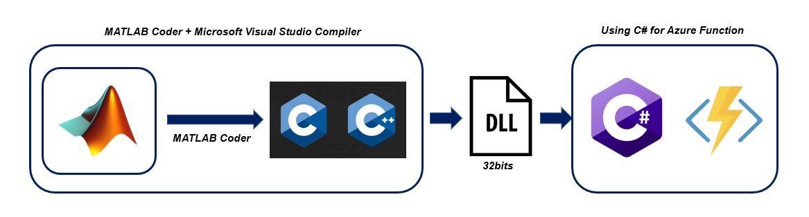
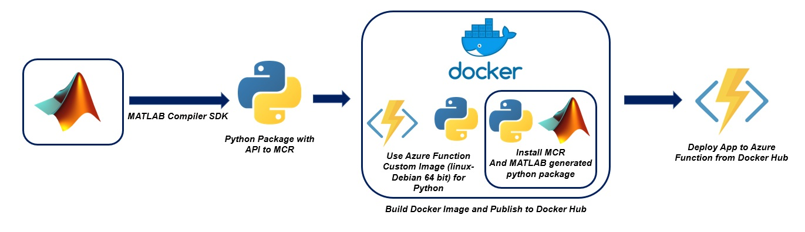

# Deploy MATLAB Algorithm to Azure Function

---

## Introduction :

Azure Function is a serverless compute service that enables user to run event-triggered code without having to provision or manage infrastructure. Being as a trigger-based service, it runs a script or piece of code in response to a variety of events.

Azure Functions can be used to achieve decoupling, high throughput, reusability and shared. Being more reliable, it can also be used for the production environments.

However, as of March 2021, Azure Function is only supporting C#, Javascript, F#, Java, Powershell, Python, and TypeScript.They are mainly opensource language.

In this documentation, it will walk you through two ways to embed MATLAB Algorithm into Azure Function.
  1) through MATLAB Coder > C# (.dll)
  2) through MATLAB Compiler SDK > Python Package > Docker Image

Generally, solution(1) would allow your Azure function response faster than solution(2), as the C# is directly supported by Azure function natively. For solution (2), it requires more storage space for the docker image. Intuitively, solution (2) might be preferable due to MATLAB Runtime supports almost all MATLAB Function but MATLAB Coder is only supporting limited function for code generation. 

Function supported for code generation (MATLAB Coder):
[MathWorks Documentation](https://www.mathworks.com/help/coder/ug/functions-and-objects-supported-for-cc-code-generation.html)

Any inquiries, you may email me : kevin.chng@techsource-asia.com, I will try to help if my time is allowed.

---

## Solution 1 : MATLAB Coder

In this solution, we will generate standalone c/c++ source code from MATLAB algorithm and wrap it as dll.
By default, Azure function supports 32bits Platform, it might require more troubleshooting if we try to switch it to 64bits. Therefore, the generated MATLAB .dll has to be 32bits. This process could be done using MATLAB Coder and Visual Studio Compiler. Subsequently, we embed this .dll into our Azure Function dotnet framework and later deploy to Azure Cloud.

---

### Configure your local environment :
Before you begin, you must have the following:

1) [Azure Function Tool](https://docs.microsoft.com/en-us/azure/azure-functions/functions-run-local?tabs=windows%2Ccsharp%2Cbash#v2)
2) Microsoft Visual Studio 9.0/10.0/11.0/12.0/14.0/15.0
3) MATLAB & MATLAB Coder

### References:
The links below are my references for this solution:

1) [Generate 32bits dll using MATLAB Coder](https://www.mathworks.com/help/coder/ug/build-32-bit-dll-on-64-bit-windows-platform-using-msvc-toolchain.html)
2) [Create C# function in Azure for Command Line (Azure Function)](https://docs.microsoft.com/en-us/azure/azure-functions/create-first-function-cli-csharp?tabs=azure-cli%2Cbrowser)

### Example :
Below is the detail steps to deploy Azure Function through MATLAB Coder:

[Example](https://github.com/KevinChngJY/azurefunction_matlab_deployment/blob/main/MATLAB_Coder_Azure_Function.md)

---

## Solution 2 : MATLAB Compiler SDK

In this solution, we will deploy code to Azure Function as a custom docker container using a linux base image. This customer image allows us to install additional dependency or configuration that isn't provided by the built in image. We insall MATLAB runtime (MCR) inside this custom docker container to provide the environment to run MATLAB code.

Although you are allowed to install additional dependency inside the custom docker, it is still restricted us to only use the following languages:
C#,Java,Javascript,PowerShell,Python,TypeScript

For this solution, I use python as a bridge to linkup Azure Function and MCR. However, when you are selecting other languages, kindly make sure that your selected linux base image is 64bit which MCR requires 64bits environment.

Deploying function code in a custom Linux container requires Premium plan or a Dedicated (App Service) plan hosting. Therefore, completing this example might incurs costs of a few US dollars in your Azure account, which you can minimize by cleaning-up resources when you're done.

---

### Configure your local environment :
Before you begin, you must have the following:

1) [Azure Function Tool](https://docs.microsoft.com/en-us/azure/azure-functions/functions-run-local?tabs=windows%2Ccsharp%2Cbash#v2)
2) The Azure CLI version 2.4 or later.
3) Python 3.8 (64-bit), Python 3.7 (64-bit), Python 3.6 (64-bit), which are supported by Azure Functions.
4) Docker and Docker ID
5) MATLAB and MATLAB Compiler SDK

### References:
The links below are my references for this solution:

1) [Generate Python Package and Build Python Application](https://www.mathworks.com/help/compiler_sdk/gs/create-a-python-application-with-matlab-code.html)
2) [Create a function on Linux using a custom container (Azure Function)]https://docs.microsoft.com/en-us/azure/azure-functions/functions-create-function-linux-custom-image?tabs=bash%2Cportal&pivots=programming-language-python)

### Example :

Use Window as development environment : [Example]https://github.com/KevinChngJY/azurefunction_matlab_deployment/blob/main/MATLAB_Compiler_Azure_Function_Window.md)

Use linux as development environment : [Example]https://github.com/KevinChngJY/azurefunction_matlab_deployment/blob/main/MATLAB_Compiler_Azure_Function_Linux.md)

---

## Other possibilities

